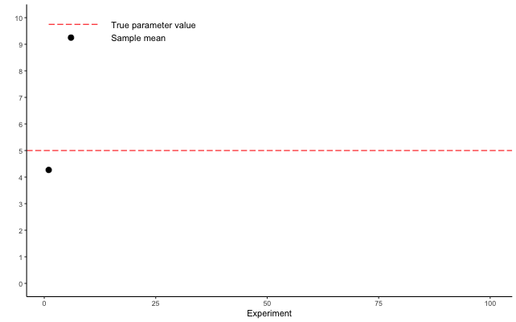

```{r setup, echo = FALSE, include=FALSE}
options(htmltools.dir.version = FALSE)
knitr::opts_chunk$set(echo = FALSE, fig.align = 'center', warning=FALSE, message=FALSE, fig.retina = 2)
source(here::here("R/zzz.R"))
library(emo)
# library(gganimate)
```

# what is statistics?

<br/>
<br/>
> The study of the collection, analysis, interpretation, presentation, and organization of data (Dodge 2006)  

<br/>  
--
<br/>
> The science of learning from data (various)  

---
# why do we need statistics?

### Common tasks  
- Estimate unknown parameters  
<br/>

--
- Test hypotheses  
<br/>

--
- Describe stochastic systems  
<br/>

--
- Make predictions that account for uncertainty  

---
# populations vs samples

#### Population  
- A collection of subjects of interest  

- Often, a biologically meaningful unit  

- Sometimes a process of interest  

- Sometimes considered to be infinitely large  

--

#### Sample

- A finite subset of the population of interest  

- i.e., the data we collect  

- We use the sample to draw inferences about the population  

---
# probability distributions

In parametric statistics, we assume that the population can be characterized by a **probability distribution**  

--

Probability distributions describe the probability of observing a particular outcome of a random variable
<br/>

--

.pull-left[**Continuous distributions**  

- normal (a.k.a Gaussian)  

- beta  

- gamma  
]

--

.pull-right[**Discrete distributions**  

- Poisson  

- binomial  

- multinomial  
]

---
# normal distribution

```{r normal, fig.width=8, fig.height=6}
curve(dnorm(x, 5, 2), -5, 15, ylim=c(0, 0.3),
      main="Normal distribution with mean=5 and variance=4",
      ylab="Probability density", xlab="Random variable")
```

--

**Remember: This is the population!**

---
# normal distribution

```{r normal_samp, fig.width=8, fig.height=6}
curve(dnorm(x, 5, 2), -5, 15, ylim=c(0, 0.3),
      main="Histogram of sample (n=25) with mean=4.7 and variance=3.4",
      ylab="Probability density", xlab="Random variable")
set.seed(3408)
x <- rnorm(25, 5, 2)
rug(x)
hist(x, freq=FALSE, add=TRUE, col="lightblue")
curve(dnorm(x, 5, 2), -5, 15, add=TRUE)
segments(5, 0, 5, 1, col="blue", lty=1, lwd=2)
segments(mean(x), 0, mean(x), 1, col="red", lty=3, lwd=2)
```


---
# parameters vs statistics

### Parameters 

- Attributes of the population  
  + Mean ( $\mu$ )  
  + Variance ( $\sigma^2$ )  
  + Standard deviation ( $\sigma$ )  

--
- Usually unknown  

--
- Parameters are the quantities of interest  

--

### Statistics

- Attributes of the sample  
  + Mean ( $\bar{y}$ or $\hat{\mu}$ )  
  + Variance ( $s^2$ or $\hat{\sigma}^2$ )  
  + Standard deviation ( $s$ or $\hat{\sigma}$ )  

--
- Often treated as estimates of parameters

---
# summary statistics

### Measures of central tendency

- Sample mean

$$\large \bar{y} = \frac{\sum_{i=1}^n y_i}{n}$$

<br/>

--
- Median  

<br/>
--

- Mode

---
# summary statistics

### Measures of dispersion

- Sample variance

$$\large s^2 = \frac{\sum_{i=1}^n (y_i - \bar{y})^2}{n-1}$$

<br/>

--
- Sample standard deviation

$$\large s = \sqrt{s^2}$$

<br/>

--
- Range  

---
# inferential statistics

<br/>
> The sample standard deviation ( $s$ ) is a descriptive statistic  

$$\Large s = \sqrt{s^2}$$

<br/>
--

> The standard error (SE) is an inferential statistic  

$$\Large SE = \frac{s}{\sqrt{n}}$$
--

### What's the difference?  

---
# standard error

<br/>

```{r sampling, fig.width=9, fig.height=5.6}
set.seed(623456)

samp <- data.frame(Experiment = 1:100,
                   time = 1:100,
                   Estimate = numeric(length = 100),
                   SD = numeric(length = 100),
                   SE = numeric(length = 100))

for(i in 1:100){
  x <- rnorm(25, 5, 3)
  samp$Estimate[i] <- mean(x)
  samp$SD[i] <- sd(x)
  samp$SE = sd(x)/sqrt(25)
}


p <- ggplot(samp[samp$Experiment==1,], aes(x = Experiment, y = Estimate)) +
  geom_point() +
  geom_hline(yintercept = 5, color = "red", linetype = "longdash") +
  scale_y_continuous(name = "", limits = c(0, 10), breaks = seq(from = 0, to = 10)) +
  scale_x_continuous(limits = c(0, 100)) +
  theme_classic() +
  geom_segment(aes(y = 9.75, yend = 9.75, x = 1, xend = 12), 
               color = "red", linetype = "longdash") +
  annotate(x = 15, y = 9.75, label = "True parameter value", geom = "text", hjust = 0) +
  geom_point(aes(y = 9.25, x = 6)) +
  annotate(x = 15, y = 9.25, label = "Sample mean", geom = "text", hjust = 0) 
p
```

---
# standard error

<br/>

```{r sampling_sd, fig.width=9, fig.height=5.6}
p + geom_errorbar(data = samp[samp$Experiment==1,], aes(x = Experiment, ymin = Estimate - SD, ymax = Estimate + SD), width = 0)
```

--

**Remember** - this error bar is the standard deviation **of our sample**!  


---
# standard error

What we really want to know is, how far is the sample mean from the true parameter value?

--

```{r sample_se, fig.width=9, fig.height=5.6}
p + geom_segment(aes(x = 1, xend = 1, y = 5, yend = Estimate), color = "blue")
```


---
# standard error

Imagine we could repeat our experiment 100 times

```{r sample_gif}


```

---
# standard error

The 100 sample means is referred to as the **sampling distribution**  

```{r sampling_dist, , fig.width=9, fig.height=5.6}
ggplot(samp, aes(x = Experiment, y = Estimate)) +
  geom_point() +
  geom_hline(yintercept = 5, color = "red", linetype = "longdash") +
  scale_y_continuous(name = "", limits = c(0, 10), breaks = seq(from = 0, to = 10)) +
  scale_x_continuous(limits = c(0, 100)) +
  theme_classic() +
  geom_segment(aes(y = 9.75, yend = 9.75, x = 1, xend = 12), 
               color = "red", linetype = "longdash") +
  annotate(x = 15, y = 9.75, label = "True parameter value", geom = "text", hjust = 0) +
  geom_point(aes(y = 9.25, x = 6)) +
  annotate(x = 15, y = 9.25, label = "Sample mean", geom = "text", hjust = 0) 
```

---
# standard error

The 100 sample means is referred to as the **sampling distribution**  

```{r sampling_dist2, , fig.width=9, fig.height=5.6}
nSim1 <- 100
xbar <- lower <- upper <- numeric(nSim1)
mu <- 5
sigma <- 2
n1 <- 25
set.seed(389)
for(i in 1:nSim1) {
    x <- rnorm(n1, mu, sigma)
    xbar[i] <- mean(x)
    SE <- sd(x)/sqrt(n1)
    lower[i] <- xbar[i] - 1.96*SE
    upper[i] <- xbar[i] + 1.96*SE
}

curve(dnorm(x, 5, 2), 0, 10, ylim=c(0, 1.5),
      main="Histogram of the sampling distribution",
      ylab="Probability density", xlab="Random variable")
rug(xbar)
hist(xbar, freq=FALSE, add=TRUE, col="lightblue")
curve(dnorm(x, 5, 2), -5, 15, add=TRUE)
```

---
# standard error

> The standard error is the standard deviation **of the sampling distribution**, i.e., how far, on average, is a sample mean from the true population value

```{r sampling_se, , fig.width=9, fig.height=5.6}
ggplot(samp, aes(x = Experiment, y = Estimate)) +
  geom_segment(aes(x = Experiment, xend = Experiment, y = 5, yend = Estimate), color = "blue") +
  geom_point() +
  geom_hline(yintercept = 5, color = "red", linetype = "longdash") +
  scale_y_continuous(name = "", limits = c(0, 10), breaks = seq(from = 0, to = 10)) +
  scale_x_continuous(limits = c(0, 100)) +
  theme_classic() +
  geom_segment(aes(y = 9.75, yend = 9.75, x = 1, xend = 12), 
               color = "red", linetype = "longdash") +
  annotate(x = 15, y = 9.75, label = "True parameter value", geom = "text", hjust = 0) +
  geom_point(aes(y = 9.25, x = 6)) +
  annotate(x = 15, y = 9.25, label = "Sample mean", geom = "text", hjust = 0) 
```

???

The standard error of the sample mean is an estimate of how far the sample mean is likely to be from the population mean, whereas the standard deviation of the sample is the degree to which individuals within the sample differ from the sample mean

---
# standard error

#### We rarely repeat experiments

<br/>
--

#### But we can estimate properties of the sampling distribution from a single sample!
<br/>

$$\Large SE = \frac{s}{\sqrt{n}}$$

--

#### This is very useful for constructing confidence intervals
<br/>

---
# confidence intervals

> If we calculated a $x$% confidence internal from $n$ samples of the population, about $x$% of those confidence intervals would contain the true population mean  

--

```{r ci, fig.width=9, fig.height=5.6}
samp <- dplyr::mutate(samp, LCI = Estimate - 1.96 * SE,
                            UCI = Estimate + 1.96 * SE,
                      Coverage = ifelse(LCI <=5 & UCI >= 5, "Yes", "No"))
ggplot(samp, aes(x = Experiment, y = Estimate)) +
  geom_errorbar(aes(ymin = LCI, ymax = UCI, color = Coverage), width = 0) +
  geom_point(aes(color = Coverage)) +
  scale_color_manual(values = c("red", "black")) +
  geom_hline(yintercept = 5, color = "red", linetype = "longdash") +
  scale_y_continuous(name = "", limits = c(0, 10), breaks = seq(from = 0, to = 10)) +
  scale_x_continuous(limits = c(0, 100)) +
  theme_classic() +
  geom_segment(aes(y = 9.75, yend = 9.75, x = 1, xend = 12), 
               color = "red", linetype = "longdash") +
  annotate(x = 15, y = 9.75, label = "True parameter value", geom = "text", hjust = 0) +
  geom_point(aes(y = 9.25, x = 6)) +
  annotate(x = 15, y = 9.25, label = "Sample mean and 95% confidence interval", geom = "text", hjust = 0) 
```

???

It's worth remembering that 1 - $x$% of the time, the confidence interval we calculate from our sample **will not** include the true population mean. Of course, with our real data, we have no way of knowing if our sample is one of the black points on this graph `r ji("grinning face")` or one of the red dots `r ji("crying face")`

---
# for thought

#### If our goal is generally to decrease uncertainty in parameter estimates:

--
- What factors determine the magnitude of our uncertainty estimates (SE or confidence intervals)?

<br/>

--
- What can we, as researchers, control when we design experiments to minimize uncertainty? What can we not control?

---
# looking ahead

### Next time: t-tests

### Reading: Dowdy et al. Chp. 8
