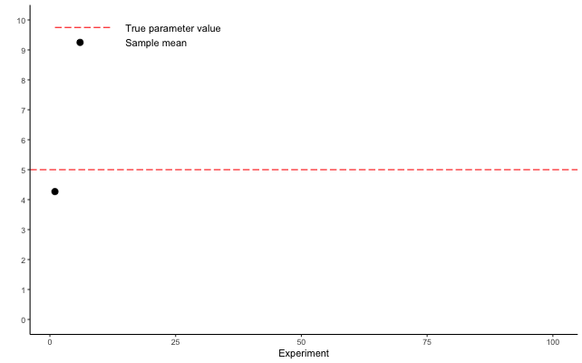

```{r setup, echo = FALSE, include=FALSE}
options(htmltools.dir.version = FALSE)
knitr::opts_chunk$set(echo = FALSE, fig.align = 'center', warning=FALSE, message=FALSE, 
                      fig.retina = 2)
library(FANR6750)
source(here::here("R/zzz.R"))
library(emo)
```

class: inverse

# outline

--

#### 1) Probability and parameters

<br/>

--
#### 2) Populations vs samples

<br/>  
--

#### 3) Common "statistics"

<br/> 
--

#### 4) Sampling distributions

<br/> 
--

#### 5) Uncertainty: Standard errors and confidence intervals

---
class: inverse, center, middle

# probability

---
# probability 

#### The dynamics of biological systems are inherently uncertain due to *stochasticity*  

--

#### Stochastic processes:  

--

+ Given an input, the process will not always return the same output

--

+ The output of stochastic processes are therefore *uncertain*

--

+ Even though stochastic processes are inherently uncertain, they are not *unpredictable* 

---
# probability

#### *Random variables* can take on different values due to chance (i.e., stochastic)  

--
#### *Probability* allows us to summarize how likely each possible value of a random variable is to occur  

--

- Usually quantified using a *probability distribution*

---
# probability distributions

#### Mathematical function that tells us how likely each possible value of a random variable is to occur

--

- Characterized by a *sample space*, i.e., all possible values (real or integer? negative?)

--

- Area under the curve must sum to 1 

--

- Many available (normal, Poisson, gamma, beta, Direchlet, binomial, Bernoulli, etc.)

--

- Shape of each distribution is governed by *parameters*

---
# the normal distributioin

```{r, echo=FALSE, fig.align='center', fig.height=3.5, fig.width=6}
norm_df <- data.frame(z = seq(from = -10, to = 10, by = 0.1),
                       pr_z = dnorm(x = seq(from = -10, to = 10, by = 0.1), 0, 3))

ggplot(norm_df, aes(x = z, y = pr_z)) + 
  geom_path() +
  scale_y_continuous("Density")
```


--
 
- Two parameters: $\large \mu$ and $\large \sigma$

    + $\mu$ is the mean, i.e., the most probable value
    
    + $\sigma$ is the standard deviation, i.e., how far (on average) are values from the mean

---
# the normal distributioin

```{r, echo=FALSE, fig.align='center', fig.height=3.5, fig.width=6}
norm_df <- data.frame(z = seq(from = -10, to = 10, by = 0.1),
                       pr_z = dnorm(x = seq(from = -10, to = 10, by = 0.1), 0, 3))

ggplot(norm_df, aes(x = z, y = pr_z)) + 
  geom_path() +
  scale_y_continuous("Density")
```
 
- Two parameters: $\large \mu$ and $\large \sigma$

- Very common in nature. Why?

    + Hint: [Central limit theorem](https://seeing-theory.brown.edu/probability-distributions/index.html)
    
---
# the normal distributioin

```{r, echo=FALSE, fig.align='center', fig.height=3.5, fig.width=6}
norm_df <- data.frame(z = seq(from = -10, to = 10, by = 0.1),
                       pr_z = dnorm(x = seq(from = -10, to = 10, by = 0.1), 0, 3))

ggplot(norm_df, aes(x = z, y = pr_z)) + 
  geom_path() +
  scale_y_continuous("Density")
```
 
- Two parameters: $\large \mu$ and $\large \sigma$

- Very common in nature. Why?

#### Much of what we'll do this semester comes down to determining whether different normal distributions have the same mean (or standard deviation)!


---
# populations vs samples

#### Population  
- A collection of subjects of interest  

- Often, a biologically meaningful unit  

- Sometimes a process of interest  

--

#### Sample

- A finite subset of the population of interest, i.e. the data we collect  

- Samples allow us to draw inferences about the population  

- Good samples are:
    + Random  
    + Representative  
    + Sufficiently large  

---
# normal distribution

```{r normal, fig.width=8, fig.height=6}
wing_df <- data.frame(z = seq(from = 60, to = 80, by = 0.1),
                       pr_z = dnorm(x = seq(from = 60, to = 80, by = 0.1), 70, 2))

ggplot(wing_df, aes(x = z, y = pr_z)) + 
  geom_path(color = "#446E9B") +
  scale_y_continuous("Density") +
  scale_x_continuous("Wing length (mm)")
```

--

**Remember: This is the population!**

---
# normal distribution

```{r normal_samp, fig.width=8, fig.height=6}
set.seed(3405)
wing_samp <- data.frame(x = rnorm(25, 70, 2))
ggplot() + 
  geom_histogram(data = wing_samp, aes(x = x, y = ..density..), 
                 fill = "#999999", alpha = 0.75, color = "#999999") +
  geom_rug(data = wing_samp, aes(x = x), color = "#D47500") +
  geom_path(data = wing_df, aes(x = z, y = pr_z), color = "#446E9B") +
  scale_y_continuous("Density") +
  scale_x_continuous("Wing length (mm)") +
  labs(title = "n = 25")
```


---
# parameters vs statistics

### Parameters 

- Attributes of the population  
  + Mean ( $\mu$ )  
  + Variance ( $\sigma^2$ )  
  + Standard deviation ( $\sigma$ )  

--
- Usually unknown  

--
- Parameters are the quantities of interest  

--

### Statistics

- Attributes of the sample  
  + Mean ( $\bar{y}$ or $\hat{\mu}$ )  
  + Variance ( $s^2$ or $\hat{\sigma}^2$ )  
  + Standard deviation ( $s$ or $\hat{\sigma}$ )  

--
- Often treated as estimates of parameters

---
# summary statistics

### Measures of central tendency

- Sample mean

$$\large \bar{y} = \frac{\sum_{i=1}^n y_i}{n}$$

<br/>

--
- Median  

<br/>
--

- Mode

---
# summary statistics

```{r mu_samp, fig.width=8, fig.height=6}
ggplot() + 
  geom_histogram(data = wing_samp, aes(x = x, y = ..density..), 
                 fill = "#999999", alpha = 0.75, color = "#999999") +
  geom_rug(data = wing_samp, aes(x = x), color = "#D47500") +
  geom_path(data = wing_df, aes(x = z, y = pr_z), color = "#446E9B") +
  geom_vline(xintercept = 70, color = "#446E9B") +
  geom_vline(xintercept = mean(wing_samp$x), color = "#D47500", linetype = "dashed") +
  scale_y_continuous("Density") +
  scale_x_continuous("Wing length (mm)") +
  labs(title = expression(paste(mu, "= 70, ", bar(y), " = 70.1")))
```

---
# summary statistics

### Measures of dispersion

- Sample variance

$$\large s^2 = \frac{\sum_{i=1}^n (y_i - \bar{y})^2}{n-1}$$

<br/>

--
- Sample standard deviation

$$\large s = \sqrt{s^2}$$

<br/>

--
- Range  

---
# summary statistics


```{r s_samp, fig.width=8, fig.height=6}
ggplot() + 
    geom_rect(aes(xmin = mean(wing_samp$x) - sd(wing_samp$x),
                xmax = mean(wing_samp$x) + sd(wing_samp$x),
                ymin = -Inf, ymax = Inf), alpha = 0.5, fill = "#D47500") +
  geom_histogram(data = wing_samp, aes(x = x, y = ..density..), 
                 fill = "#999999", alpha = 0.75, color = "#999999") +
  geom_rug(data = wing_samp, aes(x = x), color = "#D47500") +
  geom_path(data = wing_df, aes(x = z, y = pr_z), color = "#446E9B") +

  scale_y_continuous("Density") +
  scale_x_continuous("Wing length (mm)", expand = c(0, 0)) +
  labs(title = expression(paste(sigma, "= 2, ", "s = 1.8")))
```

---
# sampling error

#### Question: What is the probablity that $\large \bar{y} = \mu$?

--

- Answer: 0 (why?)

--

#### Fact: The sample mean will never equal the population mean

--

- The difference between $\large \bar{y}$ and $\large \mu$ is **sampling error** 

--

- Sampling error can be reduced but it cannot be eliminated

--

#### Problem: If we don't know $\large \mu$, how do we know how far our estimate is from the true value?

--
- Answer: We don't (for any specific sample)

--
- BUT...we do know how far, on average, a sample of size $n$ will be from the true value

---
# descriptive vs inferential statistics 

> The sample standard deviation ( $s$ ) is a descriptive statistic  

$$\Large s = \sqrt{s^2}$$

- $s$ tells us how far, on average, each observation $y$ is from the sample mean $\bar{y}$

<br/>
--

> The standard error (SE) is an inferential statistic  

$$\Large SE = \frac{s}{\sqrt{n}}$$
- $SE$ tells us how far, on average, each sample mean $\bar{y}$ is from the population mean $\mu$

???

What do we mean by "each sample"? After all, we generally only have one sample. 

Standard error is based on the idea that we could collect (or, more likely simulate) lots and lots and lots of samples (ideally infinite), all from the same population and with the same sample size $n$?

---
class:inverse, center, middle

#the sampling distribution

---
# a single sample (n = 25)

<br/>

```{r sampling, fig.width=9, fig.height=5.6}
set.seed(623451)

samp <- data.frame(Experiment = 1:100,
                   time = 1:100,
                   Estimate = numeric(length = 100),
                   SE = numeric(length = 100))

for(i in 1:100){
  x <- rnorm(25, 70, 2)
  samp$Estimate[i] = mean(x)
  samp$SD[i] = sd(x)
  samp$SE = sd(x)/sqrt(25)
}

p <- ggplot(samp[samp$Experiment==1,], aes(x = Experiment, y = Estimate)) +
  geom_point() +
  geom_hline(yintercept = 70, color = "red", linetype = "longdash") +
  scale_y_continuous(name = "", limits = c(66, 73), breaks = seq(from = 66, to = 73)) +
  scale_x_continuous(limits = c(0, 100)) +
  theme_classic() +
  geom_segment(aes(y = 72.75, yend = 72.75, x = 1, xend = 12), 
               color = "red", linetype = "longdash") +
  annotate(x = 15, y = 72.75, label = "True parameter value", geom = "text", hjust = 0) +
  geom_point(aes(y = 72.25, x = 6)) +
  annotate(x = 15, y = 72.25, label = "Sample mean", geom = "text", hjust = 0) 
p
```

---
# standard deviation

<br/>

```{r sampling_sd, fig.width=9, fig.height=5.6}
p + geom_errorbar(data = samp[samp$Experiment==1,], aes(x = Experiment, ymin = Estimate - SD, ymax = Estimate + SD), width = 0)
```

--

**Remember** - this error bar is the standard deviation **of our sample**!  


---
# standard error

But remember, what we really want to know is, how far is the sample mean from the true parameter value?

--

```{r sample_se, fig.width=9, fig.height=5.6}
p + geom_segment(aes(x = 1, xend = 1, y = 70, yend = Estimate), color = "blue")
```


---
# standard error

Imagine we could repeat our experiment 100 times

```{r sample_gif}


```

---
# standard error

The 100 sample means is referred to as the **sampling distribution**  

```{r sampling_dist, , fig.width=9, fig.height=5.6}
ggplot(samp, aes(x = Experiment, y = Estimate)) +
  geom_point() +
  geom_hline(yintercept = 70, color = "red", linetype = "longdash") +
  scale_y_continuous(name = "", limits = c(68, 73), breaks = seq(from = 68, to = 73)) +
  scale_x_continuous(limits = c(0, 100)) +
  theme_classic() +
  geom_segment(aes(y = 72.75, yend = 72.75, x = 1, xend = 12), 
               color = "red", linetype = "longdash") +
  annotate(x = 15, y = 72.75, label = "True parameter value", geom = "text", hjust = 0) +
  geom_point(aes(y = 72.25, x = 6)) +
  annotate(x = 15, y = 72.25, label = "Sample mean", geom = "text", hjust = 0) 
```

---
# standard error

The 100 sample means is referred to as the **sampling distribution**  

```{r sampling_dist2, , fig.width=9, fig.height=5.6}
wing_df <- data.frame(z = seq(from = 63, to = 77, by = 0.1),
                      pr_z = dnorm(x = seq(from = 63, to = 77, by = 0.1), 70, 2))

ggplot() + 
  geom_histogram(data = samp, aes(x = Estimate, y = ..density..), 
                 fill = "#999999", alpha = 0.75, color = "#999999", bins = 60) +
  geom_rug(data = samp, aes(x = Estimate), color = "#D47500") +
  geom_path(data = wing_df, aes(x = z, y = pr_z), color = "#446E9B") +
  scale_y_continuous("Density") +
  scale_x_continuous("Sample mean", expand = c(0, 0))
```

---
# standard error

> The standard error is the standard deviation **of the sampling distribution**, i.e., how far, on average, is a sample mean from the true population value

```{r sampling_se, , fig.width=9, fig.height=5.6}
ggplot(samp, aes(x = Experiment, y = Estimate)) +
  geom_segment(aes(x = Experiment, xend = Experiment, y = 70, yend = Estimate), color = "blue") +
  geom_point() +
  geom_hline(yintercept = 70, color = "red", linetype = "longdash") +
  scale_y_continuous(name = "", limits = c(68, 73), breaks = seq(from = 68, to = 73)) +
  scale_x_continuous(limits = c(0, 100)) +
  theme_classic() +
  geom_segment(aes(y = 72.75, yend = 72.75, x = 1, xend = 12), 
               color = "red", linetype = "longdash") +
  annotate(x = 15, y = 72.75, label = "True parameter value", geom = "text", hjust = 0) +
  geom_point(aes(y = 72.25, x = 6)) +
  annotate(x = 15, y = 72.25, label = "Sample mean", geom = "text", hjust = 0) 
```

???

The standard error of the sample mean is an estimate of how far the sample mean is likely to be from the population mean, whereas the standard deviation of the sample is the degree to which individuals within the sample differ from the sample mean

---
# standard error

#### We rarely repeat experiments

<br/>
--

#### But we can estimate properties of the sampling distribution from a single sample!
<br/>

$$\Large SE = \frac{s}{\sqrt{n}}$$

--

#### This is very useful for estimating uncertainty in our estimates
<br/>

---
# confidence intervals

> If we calculated a $x$% confidence interval from $n$ samples of the population, about $x$% of those confidence intervals would contain the true population mean  

--

```{r ci, fig.width=9, fig.height=5.6}
samp <- dplyr::mutate(samp, LCI = Estimate - 1.96 * SE,
                      UCI = Estimate + 1.96 * SE,
                      Coverage = ifelse(LCI <=70 & UCI >= 70, "Yes", "No"))
ggplot(samp, aes(x = Experiment, y = Estimate)) +
  geom_errorbar(aes(ymin = LCI, ymax = UCI, color = Coverage), width = 0) +
  geom_point(aes(color = Coverage)) +
  scale_color_manual(values = c("red", "black")) +
  geom_hline(yintercept = 70, color = "red", linetype = "longdash") +
  scale_y_continuous(name = "", limits = c(68, 73), breaks = seq(from = 68, to = 72)) +
  scale_x_continuous(limits = c(0, 100)) +
  theme_classic() +
  geom_segment(aes(y = 72.75, yend = 72.75, x = 1, xend = 12), 
               color = "red", linetype = "longdash") +
  annotate(x = 15, y = 72.75, label = "True parameter value", geom = "text", hjust = 0) +
  geom_point(aes(y = 72.25, x = 6)) +
  annotate(x = 15, y = 72.25, label = "Sample mean and 95% confidence interval", geom = "text", hjust = 0) 

```

???

It's worth remembering that 1 - $x$% of the time, the confidence interval we calculate from our sample **will not** include the true population mean. Of course, with our real data, we have no way of knowing if our sample is one of the black points on this graph `r ji("grinning face")` or one of the red dots `r ji("crying face")`

---
# for thought

#### If our goal is generally to decrease uncertainty in parameter estimates:

--
- What factors determine the magnitude of our uncertainty estimates (SE or confidence intervals)?

<br/>

--
- What can we, as researchers, control when we design experiments to minimize uncertainty? What can we not control?

---
# looking ahead

<br/>

#### **Next time:** Introduction to linear models

<br/>

#### **Reading:** Quinn chp. 5.2-5.3

