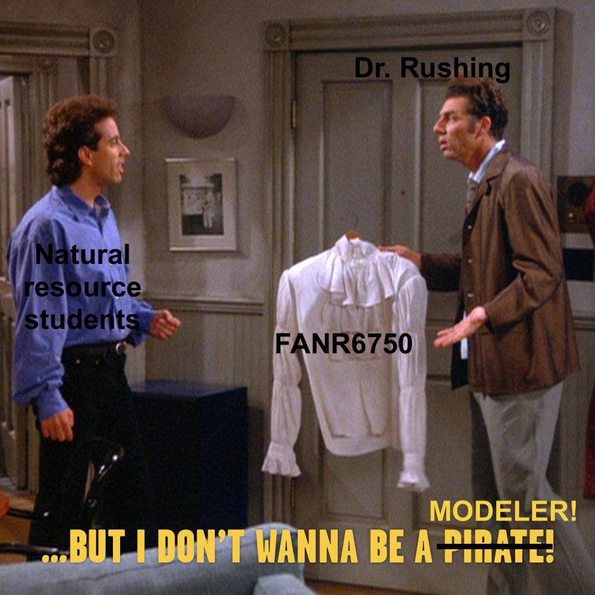
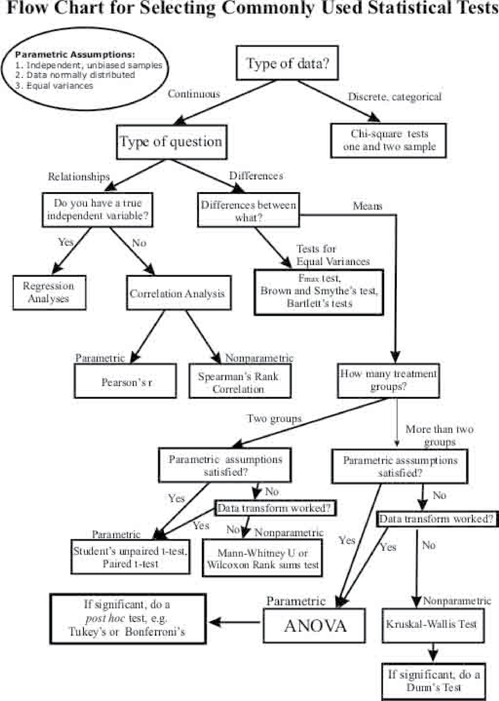

```{r setup, echo = FALSE, include=FALSE}
options(htmltools.dir.version = FALSE)
knitr::opts_chunk$set(echo = FALSE, fig.align = 'center', warning=FALSE, message=FALSE, 
                      fig.retina = 2)
library(FANR6750)
#library(emo)
library(kableExtra)
source(here::here("R/zzz.R"))
# library(gganimate)
```

class: inverse

# outline

<br/>
#### 1) What is a model?

<br/>  
--

#### 2) What is a linear model?

<br/> 

--

#### 3) Linear model assumptions

---
# what is a model?


---
# what is a model?

> "an informative representation of an object, person or system"

--

#### Many types (conceptual, graphical, mathematical)

--

#### In this class, we will deal with *statistical* models

--

- Mathematical representation of our hypothesis

--

- By necessity, models will be simplifications of reality ("all models are wrong...") 

--

- Do not have to be complex

---
# but i don't want to be a modeler!

```{r echo = FALSE, out.height="75%", out.width="50%"}

```

--
- Inference **requires** models  

--
- Models link **observations** to **processes**  

--
- Models are tools that allow us understand processes that we **cannot directly observe** based on quantities that we **can** observe  

---
# a simple model

</br>
</br>

$$\Huge y = a + bx$$

--

```{r, echo=FALSE, fig.align='center', fig.height=2.5, fig.width=5}
x <- seq(from = -10, to = 10, by = 0.1)
line_df <- data.frame(x = x,
                      y = -5 + 2 * x)

ggplot(line_df, aes(x = x, y = y)) + 
  geom_path(color = "#446E9B")
```

--
It may not be obvious, but this is essentially the only model we will use this semester<sup>1</sup>

.footnote[[1] With some minor variations, mainly in $x$]

---
# a simple model

</br>
</br>

$$\Huge y = a + bx$$


```{r, echo=FALSE, fig.align='center', fig.height=2.5, fig.width=5}
ggplot(line_df, aes(x = x, y = y)) + 
  geom_path(color = "#446E9B")
```

If we want to use this as a statistical model, what's missing?

---
# a simple model

</br>
</br>

$$\Huge y = a + bx$$


```{r, echo=FALSE, fig.align='center', fig.height=2.5, fig.width=5}

ggplot(line_df, aes(x = x, y = y)) + 
  geom_path(color = "#446E9B")
```

If we want to use this as a statistical model, what's missing?

#### **Stochasticity!**

---
# a simple model

</br>
</br>

$$\Huge y = a + bx$$


```{r, echo=FALSE, fig.align='center', fig.height=2.5, fig.width=5}
x2 <- runif(n = 25, -10, 10)
samp_df <- data.frame(x = x2, y = rnorm(n = 25, -5 + 2 * x2, 4))
ggplot(line_df, aes(x = x, y = y)) + 
  geom_path(color = "#446E9B") +
  geom_point(data = samp_df, aes(x = x, y = y), color = "#D47500", alpha = 0.75)
```

If we want to use this as a statistical model, what's missing?

#### **Stochasticity!**

---
class:inverse, middle, center

# the linear model

---
# Statistics cookbook

```{r out.width="50%"}

```

---
# the linear model

<br/>
<br/>
$$\Large response = deterministic\; part+stochastic\; part$$ 
<br/>
<br/>

--
$$\underbrace{\LARGE E[y_i] = \beta_0 + \beta_1 \times x_i}_{Deterministic}$$

<br/>
<br/>

--
$$\underbrace{\LARGE y_i \sim normal(E[y_i], \sigma)}_{Stochastic}$$  

???

Note that the deterministic portion of the model has the same form as the equation for a line: $y = a + b \times x$, which is why we call these linear models

---
# the linear model

#### A "simple" example

$$\underbrace{\LARGE E[y_i] = -2 + 0.5 \times x_i}_{Deterministic}$$

--
```{r fig.height=4, fig.width=4}
x <- rbinom(100, size = 1, prob = 0.5)
y <- -2 + 0.5 * x + rnorm(100, 0, 0.25)

df <- data.frame(x = x, y = y)

ggplot(df, aes(x, y)) + geom_boxplot(color = "white") +
  geom_segment(aes(x = -0.1, xend = 0.1, y = -2, yend = -2), color = "#446E9B", size = 1.5) +
  geom_segment(aes(x = 0.9, xend = 1.1, y = -1.5, yend = -1.5), color = "#446E9B", size = 1.5) +
  scale_y_continuous(expression(mu)) +
  scale_x_continuous(breaks = c(0, 1))
```

---
# the linear model

#### A "simple" example

$$\underbrace{\LARGE E[y_i] = -2 + 0.5 \times x_i}_{Deterministic}$$

$$\underbrace{\LARGE y_i \sim normal(E[y_i], \sigma=0.25)}_{Stochastic}$$

--
```{r fig.height=4, fig.width=4}
ggplot(df, aes(x, y, group = as.factor(x))) + geom_boxplot(color = "white", width = 0.25) +
  geom_segment(aes(x = -0.1, xend = 0.1, y = -2, yend = -2), color = "#446E9B", size = 1.5) +
  geom_segment(aes(x = 0.9, xend = 1.1, y = -1.5, yend = -1.5), color = "#446E9B", size = 1.5) +
  scale_y_continuous(expression(mu)) +
  scale_x_continuous(breaks = c(0, 1)) +
  geom_point(color = "#D47500", alpha = 0.25)
```

---
# the linear model

#### Same model, different $\Large x$

$$\underbrace{\LARGE E[y_i] = -2 + 0.5 \times x_i}_{Deterministic}$$

$$\underbrace{\LARGE y_i \sim normal(E[y_i], \sigma=0.25)}_{Stochastic}$$

--
```{r fig.height=4, fig.width=6}
x <- rnorm(100)
y <- -2 + 0.5 * x + rnorm(100, 0, 0.25)
mu <- -2 + 0.5 * x
resid <- y - mu
df <- data.frame(x = x, y = y, mu = mu, Residuals = resid)

ggplot(df, aes(x, y)) + 
  geom_abline(slope = 0.5, intercept = -2, color = "#446E9B", size = 1.5) +
  scale_y_continuous(expression(mu)) +
  geom_point(color = "#D47500", alpha = 0.75)
```

---
# the linear model

#### A more complex model

$$\large y_i = \beta_0 + \beta_1x_{i1} + \beta_2x_{i2} + ... + \beta_px_{ip} + \epsilon_i$$

--

- Each $\beta$ coefficient is the effect of a specific predictor variables $x$

- Predictor variables may be continuous, binary, factors, or a combination

- We will cover more complex models (and interpretation) later

---
# is this a linear model?

$$\Large y = 20 + 0.5x - 0.3x^2$$

```{r, fig.height=3.5, fig.width=5.5}
x <- seq(from = 0, to = 10, 0.1)
lm2 <- data.frame(x = x,
                 y = 20 + 0.5 * x - 0.3 * x^2)

ggplot(lm2, aes(x = x, y = y)) +
  geom_line() 
```

---
# residuals

#### One concept we will talk about a lot is *residuals*

--

- Residuals are the difference between the observed values $y_i$ and the predicted values $E[y_i]$

```{r fig.height=3.5, fig.width=5.5}
ggplot(df, aes(x, y)) + 
  geom_segment(aes(x = x, xend = x, y = mu, yend = y), color = "#3CB521", size = 1) +
  geom_abline(slope = 0.5, intercept = -2, color = "#446E9B", size = 1.5) +
  scale_y_continuous(expression(mu)) +
  geom_point(color = "#D47500", alpha = 0.75)
```

---
# residuals

#### One concept we will talk about a lot is *residuals*

- Residuals are the difference between the observed values $y_i$ and the predicted values $E[y_i]$

```{r fig.height=3.5, fig.width=5.5}
ggplot(df, aes(x, Residuals)) + 
  geom_abline(slope = 0, intercept = 0, color = "grey40", linetype = "dashed", size = 1.5) +
  geom_point(color = "#D47500", alpha = 0.75)
```

--

- How much variation in $y$ is explained by $x$?

--

- Useful for assessing whether data violate model assumptions


---
class:inverse, center, middle

# assumptions

---
# assumptions

#### **EVERY** model has assumptions

--

- Assumptions are necessary to simplify real world to workable model

--

- If your data violate the assumptions of your model, inferences *may* be invalid

--

- **Always** know (and test) the assumptions of your model<sup>1</sup> 

.footnote[[1] You know what happens when you assume...]

---
# linear model assumptions

</br>

$$\Large y_i = \beta_0 + \beta_1 x_i + \epsilon_i$$

$$\Large \epsilon_i \sim normal(0, \sigma)$$


</br>

--

1) **Linearity**: The relationship between $x$ and $y$ is linear

--

2) **Normality**: The residuals are normally distributed<sup>2</sup>

.footnote[[2] Note that these assumptions apply to the residuals, not the data!]

--

3) **Homoscedasticity**: The residuals have a constant variance at every level of $x$

--

4) **Independence**: The residuals are independent (i.e., uncorrelated with each other)

???

Because virtually every model we will use this semester is a linear model, these assumptions apply to everything we will discuss from here out

---
# linear models

#### Very flexible

--

- Predictor(s) can take different forms (binary, continuous, factor)

--

- Can contain many predictors

--

- Can model non-linear relationships

--

#### Link different "tests" (e.g., t-tests, ANOVA, ANCOVA, linear regression)

--

#### Can be used for different statistical goals

- Estimating unknown parameters  

- Testing hypotheses  

- Describing stochastic systems  

- Making predictions that account for uncertainty  

---
# looking ahead

<br/>

#### **Next time:** t-tests and Null Hypothesis Testing

<br/>

#### **Reading:** Quinn chp. 3
