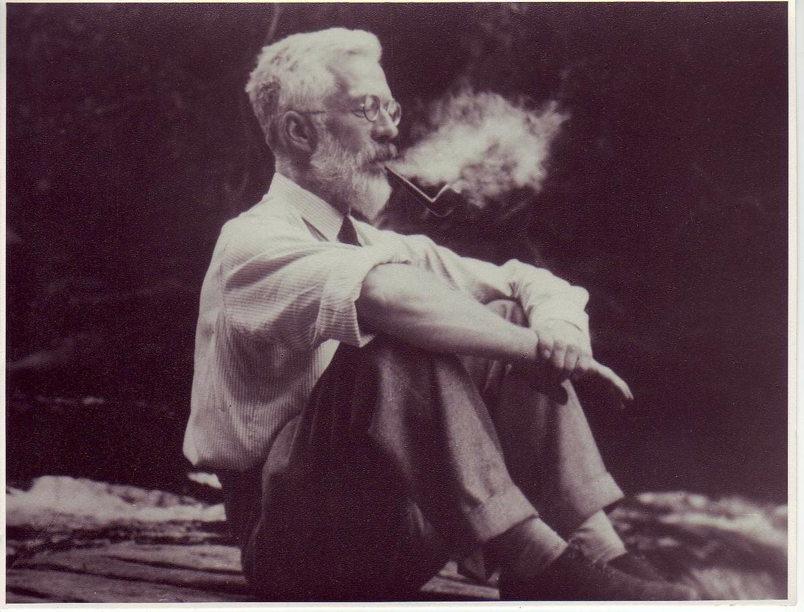

```{r setup, echo = FALSE, include=FALSE}
options(htmltools.dir.version = FALSE)
knitr::opts_chunk$set(echo = FALSE, fig.align = 'center', warning=FALSE, message=FALSE, 
                      fig.retina = 2)
library(WILD3810)
library(emo)
library(kableExtra)
# library(gganimate)
```

# motivation

<br/>

> Following a significant *F*-test, the next step is to determine which means differ  

<br/>

--
> If all group means are to be compared, then we should correct for multiple testing

<br/>

--

> That is, conducting many tests increases the probability of finding one that is significant, even if it is not

---

```{r echo = FALSE, out.height="600px"}
knitr::include_graphics("https://imgs.xkcd.com/comics/significant.png")
```

---
class: inverse

# outline

<br/>
#### 1) Fisher's LSD

<br/>  
--

#### 2) Pairwise *t*-tests

<br/> 
--

#### 3) Tukey's HSD test

<br/> 
--

#### 4) Example

---
# ronald fisher

```{r fisher, echo = FALSE, out.height="304px", out.width="400px"}

```

<br/>

> To call in the statistician after the experiment is done may be no more than asking him to perform a post-mortem examination: he may be able to say what the experiment died of

---
# fisher's lsd test

> Warning: This test makes no correction for multiple testing  

--

#### The least significant difference test is based on the two-sample *t*-statistic

$$\large t = \frac{\bar{y}_1 - \bar{y}_2}{SEDM}$$
--

#### Fisher said that 2 means ( $\bar{y}_i$ and $\bar{y}_j$ ) are different if:

$$\large |\bar{y}_i - \bar{y}_j| \geq t_{1-\alpha/2,a(n-1)}\sqrt{\frac{2MSW}{n}}$$

<br/>

where MSW (aka MSE) comes from the ANOVA table

---
class: center, inverse, middle

## PAIRWISE *t*-TEST

---
## PAIRWISE *t*-TEST

<br/>

### One can always fall back on pairwise, two-sample *t*-tests, but you should adjust the p values

<br/>

--
### Bonferroni adjustment

- Multiply each *p*-value by the number of tests  

- If this results in *p* > 1, set *p* to 1  

---
class: center, middle, inverse

# tukey's hsd test

---
# john tukey

<br/>

```{r tukey, echo = FALSE, out.height="300px", out.width="246px"}
knitr::include_graphics("figs/John_Tukey.jpeg")
```

<br/>

> The combination of some data and an aching desire for an answer does not ensure that a reasonable answer can be extracted from a given body of data

---
# tukey's hsd test

<br/>

#### According to Tukey's Honestly Significant Difference test, two means ( $\bar{y}_i$ and $\bar{y}_j$) are different if:

$$\large |\bar{y}_i - \bar{y}_j | \geq  q_{1- \alpha,a,a(n-1)}\sqrt{\frac{MSW}{n}}$$

<br/>

where $q$ comes from the "Studentized Range Distribution"(see `qtukey` in `R`). MSW comes from the ANOVA table

---
class: center, middle, inverse

# example

---
# example

**Question:** Is there a difference in Canada Warbler abundance across elevations?

<br/>

.pull-left[

```{r cawa_pic, out.width="80%", fig.align="c"}
knitr::include_graphics("https://upload.wikimedia.org/wikipedia/commons/b/b1/8G7D5475-Canada.jpg")
```

]

.pull-right[
```{r cawa1, echo = FALSE}
cawa <- data.frame(Replicate = c("1", "2", "3", "4"),
                   Low = as.character(c(1, 3, 0, 2)),
                   Medium = as.character(c(2, 0, 4, 3)),
                   High = as.character(c(4, 7, 5, 5)))

cawa %>%
  kable("html", align = 'c') %>%
  kable_styling(bootstrap_options = c("condensed"), 
                full_width = FALSE, font_size = 14) %>%
  add_header_above(c(" " = 1, "Elevation" = 3))
```
]

---
# example

**Question:** Is there a difference in Canada Warbler abundance across elevations?

<br/>

.pull-left[

```{r cawa2, echo = FALSE}
cawa <- data.frame(Replicate = c("1", "2", "3", "4"),
                   Low = as.character(c(1, 3, 0, 2)),
                   Medium = as.character(c(2, 0, 4, 3)),
                   High = as.character(c(4, 7, 5, 5)))

cawa %>%
  kable("html", align = 'c') %>%
  kable_styling(bootstrap_options = c("condensed"), 
                full_width = FALSE, font_size = 14) %>%
  add_header_above(c(" " = 1, "Elevation" = 3))
```

]

.pull-right[

```{r cawa_anova_tab}
anova_tab <- data.frame(Source = c("Among groups", "Within groups"),
                        df = c(2, 9),
                        SS = c(31.5, 18.5),
                        MS = c(15.7, 2.1),
                        F = c("7.7", ""))

anova_tab %>%
  kable("html", align = 'c', booktabs = TRUE, escape = FALSE) %>%
  kable_styling(bootstrap_options = c("condensed"), 
                full_width = FALSE, font_size = 18) 
```

]

---
# example

**Question:** Is there a difference in Canada Warbler abundance across elevations?

--

#### Fisher's LSD test

- $\large t_{1-\alpha/2,a(n-1)} = t_{0.975,9} = 2.26$  

--

- LSD = $\large t_{1-\alpha/2;a(n-1)}\sqrt{2MSW/n} = 2.32$  

--

#### Tukey's HSD test

- $\large q_{1-\alpha,a,a(n-1)} = q_{0.95,3,9} = 3.95$  

--

- HSD = $\large q_{1-\alpha,a,a(n-1)}\sqrt{MSW/n} = 2.86$  

<br/>
--
Note that it's more difficult to observe a difference between group means with the more conservative Tukey test

---
# summary

--
- Only do multiple comparison tests after a significant *F*-test  

--
- The motivation is that if you do 100 tests, 5 (on average) will be significant even if there is no difference  

--
- From least conservative to most conservative, the order is: Fisher's LSD, Tukey's HSD, and then pairwise *t*-tests with Bonferroni adjustments  

--
- There are many other types of multiple comparison tests other than the 3 we covered  

--
- Tukey's HSD test is probably the method of choice these days. However,

  + It is so conservative that sometimes you won't see any pairwise differences even after a significant *F*-test


