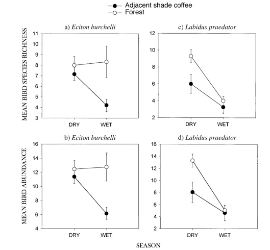

```{r setup, echo = FALSE, include=FALSE}
options(htmltools.dir.version = FALSE)
knitr::opts_chunk$set(echo = FALSE, fig.align = 'center', warning=FALSE, message=FALSE, 
                      fig.retina = 2, fig.width = 9, fig.height = 7)
library(WILD3810)
library(emo)
library(kableExtra)
library(dplyr)
library(FANR6750)
# library(gganimate)
```

# outline 

1) $\large a \times b$ design

<br/>

--

2) Model

<br/>

--

3) Procedure

<br/>

--

4) Example

<br/>

--

5) $\large a \times b \times c$ design

---
# factorial designs

<br/>

#### Often an investigator is interested in the combined effect of two types of treatments  

<br/>

--

#### For example, a study might examine the effects of **predation** and **food supplementation** on *Microtus californicus* abundance  

<br/>

--

#### We "seed" each enclosure with 10 *Microtus* and record the number of voles present after a specified period of time.

---
# *microtus californicus*

```{r out.height="90%", out.width="90%"}
knitr::include_graphics("https://upload.wikimedia.org/wikipedia/commons/d/d4/California_Vole_%28Microtus_californicus%29.jpg")
```


---
# factorial designs

```{r}

microtus<- data.frame(food = 0:3,
                      microtus = c(4, 4, 5, 6, 6, 6, 7, 8)-2,
                      pred = rep(c("With predation", "Without predation"), each = 4))

ggplot(microtus, aes(x = food, y = microtus, color = pred)) +
  geom_line() +
  geom_point(size = 5, color = "white") +
  geom_point() +
  scale_y_continuous("Microtus abundance", limits = c(0, 10)) +
  scale_x_continuous("Food supplementation")
```


---
# factorial designs

- This design differs from blocking designs in that neither of the treatments is considered extraneous to the experimental question (i.e., what controls numbers of voles?)  

--

- In this case, the experimental unit is an enclosure, and multiple enclosures are represented by and allocated to each combination of the two treatments  

--

- The treatment variables are called **factors** or main effects, and the different treatments within factors are called **levels**  

--

- The design is called a factorial design. Here, because there are two factors (predation, food), we will represent them as *A* and *B* and call this an $\large a \times b$ factorial design  

--

- Because there are $\large a = 2$ levels of predation and $\large b = 4$ levels of food supplementation, this is a $\large 2 \times 4$ factorial design  

---
# interactions

<br/>

- We are also usually interested in looking at **interactions**, which is one of the most important notions in ANOVA and experimental design  

--

- An interaction is an additional effect due to the particular combination of the two levels  

--

- If an interaction is present, it means that **the effect of one factor depends on the other factor**  

--

- For example, the effect of predation might depend on the amount of food supplementation  


---
# interactions

Graphically, interactions are indicated by significant departure from parallelism

```{r fig.width=8, fig.height=6}

microtus<- data.frame(food = 0:3,
                      microtus = c(6, 6, 6, 6, 4, 4, 7, 8)-2,
                      pred = rep(c("With predation", "Without predation"), each = 4))

ggplot(microtus, aes(x = food, y = microtus, color = pred)) +
  geom_line() +
  geom_point(size = 5, color = "white") +
  geom_point() +
  scale_y_continuous("Microtus abundance", limits = c(0, 10)) +
  scale_x_continuous("Food supplementation")
```


---
## DATA STRUCTURE FOR $\large a \times b$ FACTORIAL DESIGN

```{r}
ab <- data.frame(replicate = c("1", "2", "1", "2"),
                 pred = c("Without", "Without", "With", "With"),
                 fs0 = c('\\(y_{111}\\)', '\\(y_{112}\\)', '\\(y_{121}\\)', '\\(y_{122}\\)'),
                 fs1 = c('\\(y_{211}\\)', '\\(y_{212}\\)', '\\(y_{221}\\)', '\\(y_{222}\\)'),
                 fs2 = c('\\(y_{311}\\)', '\\(y_{312}\\)', '\\(y_{321}\\)', '\\(y_{322}\\)'),
                 fs3 = c('\\(y_{411}\\)', '\\(y_{412}\\)', '\\(y_{421}\\)', '\\(y_{422}\\)'))

ab %>%
  kable(format = "html", col.names = c(" ", " ", "0", "1", "2", "3"), escape = TRUE) %>%
  add_header_above(c("Replicate (k)" = 1, "Predation (j)" = 1, "Food supplementation (i)" = 4)) %>%
  kable_styling(bootstrap_options = c("condensed"), font_size = 14)
```

--

Notice that the subscript $k$ represents the replicate for each combination of factors A and B, and there must be replication for each combination of factors

--

Also notice that this design is balanced, i.e. there is the same number of replicates (two) for each combination of factors.


---
# model

$$\Large y_{ijk} = \mu + \alpha_i + \beta_j + \alpha \beta_{ij} + \epsilon_{ijk}$$

$$\large \epsilon_{ijk} \sim normal(0, \sigma^2)$$

$$i = 1, ..., a \;(levels \;of \;factor\;A)$$
$$j = 1, ..., b \;(levels \;of \;factor\;B)$$
$$k = 1, ..., n \;(replicates \;of \;each \;combination \;of \;A \;and \;B)$$

- $\mu =$ grand mean  

- $\alpha_i =$ effect of the $i$th level of food supplementation  

- $\beta_j =$ effect of the $j$th level of predator exclusion  

- $\alpha \beta_{ij} =$ effect of interaction of $i$th level of food and $j$th level of predation  

- $\epsilon_{ijk} =$ residual, unexplained variation

---
# hypotheses

#### Factor A

$$H_0 : \alpha_1 = \alpha_2 = ... = \alpha_a = 0$$

$$H_a : At \;least \;one \;inequality$$

#### Factor B

$$H_0 : \beta_1 = \beta_2 = ...  = \beta_b = 0$$

$$H_a : At \;least \;one \;inequality$$
--

#### Interaction of factors A & B

$$H_0 : \alpha\beta_1 = \alpha\beta_2 = ... = \alpha\beta_{ij} = 0 \;for \;all \;ij$$

$$H_a : At \;least \;one \;inequality$$

--
Technically, we could treat each of the effects as fixed or random, although it is much more common to use fixed effects in factorial designs

---
# anova table

<br/>

```{r anova_tab}
anova_tab <- data.frame(Source = c("Factor A", "Factor B", " A x B", "Error"),
                        df = c('\\(a-1\\)', '\\(b-1\\)', '\\((a-1)(b-1)\\)', '\\(ab(n-1)\\)'),
                        SS = c('\\(bn \\sum_i (\\bar{y}_{i..} - \\bar{y}_{...})^2\\)', 
                               '\\(an \\sum_j (\\bar{y}_{.j.} - \\bar{y}_{...})^2\\)',
                               '\\(n \\sum_i \\sum_j (\\bar{y}_{ij.} - \\bar{y}_{i..} - \\bar{y}_{.j.} + \\bar{y}_{...})^2\\)',
                               '\\(\\sum_i \\sum_j \\sum_k (y_{ijk} - \\bar{y}_{ij.})^2\\)'))

anova_tab %>%
  kable(align = 'c', booktabs = TRUE, escape = FALSE, format = "html") %>%
  kable_styling(bootstrap_options = c("condensed"), 
                full_width = FALSE, font_size = 18) 
```

--

#### What are the associated mean squares and F statistics?

---
# more on interactions

#### If an interaction is significant, then the effect of one factor depends on the other factor  

--

#### Thus, if an interaction is significant, then usually it is ill-advised to further investigate main effects alone (such as with multiple comparison procedures) without taking the other factor into account  

--

#### The way that you do this is to perform a multiple comparison test for one factor at each level of the other factor, and vice versa  

--

#### This is easily performed in `R` as we will see in lab  


---
class: inverse, center, middle

# example

---
# analysis of (fake) *microtus* data

#### Data are voles per enclosure

```{r}
microtus <- data.frame(replicate = rep(c("1", "2", "3", "4"), 2),
                       predation = rep(c("With", "Without"), each = 4),
                       fs0 = c(10, 12, 8, 14, 10, 12, 14, 18),
                       fs1 = c(18, 20, 21, 24, 22, 28, 36, 40),
                       fs2 = c(20, 18, 14, 16, 42, 40, 44, 42))

microtus %>%
  kable(format = "html", col.names = c(" ", " ", "0", "1", "2")) %>%
  add_header_above(c("Replicate (k)" = 1, "Predation (j)" = 1, "Food supplementation (i)" = 3)) %>%
  kable_styling(font_size = 14)
```

---
## $\large a \times b \times c$ DESIGN

- The $\large a \times b$ factorial design can be extended to three or more factors  

--

- Development of Sums of Squares, degrees of freedom, etc. are natural extensions of what we have learned before, but we will not cover them in this course. See Dowdy et al. if you are interested in the details  

--

- If the three-way interaction is significant, then the effect of one factor is dependent upon the particular levels of both of the other factors  

--

- In practice, one could try to tease apart these relationships as we discussed previously for the two-way design. However, interpretation of these results gets confusing  

--

- A much more effective approach is to present the results graphically (means and standard errors or confidence intervals) as we did before with the vole example. This will necessitate more than one graph  

---
# army ants

Roberts et al. (2000)\* followed randomly selected army ant swarms of two species (*Eciton burchellii* and *Labidus praedator*) in two habitats (shade coffee plantations and primary forest) in two seasons (dry and wet) in western Panama  

--

Of the two species, *E. burchellii* is larger and spends most of its time above ground in bivouacs or swarming, whereas *L. praedator* is smaller and spends much of its time below ground, although it also swarms above ground. The response variables were number of birds attending the swarms (to capture flushed arthropods) and the number of bird species attending the swarms  

--

This was set up as a three-way factorial design  

???

$^*$Roberts, D. L., Cooper, R. J., & Petit, L. J. (2000). Flock characteristics of ant‐following birds in premontane moist forest and coffee agroecosystems. *Ecological Applications*, 10(5), 1414-1425.

---
# army ants

.pull-left[

<br/>

```{r}
knitr::include_graphics("https://upload.wikimedia.org/wikipedia/commons/d/d3/Eciton_burchellii_army_ants.jpg")
```

]

.pull-right[

```{r}
knitr::include_graphics("https://upload.wikimedia.org/wikipedia/commons/7/74/Ocelated_Antbird_%2839995295545%29.jpg")
```

]

---
# army ants

.pull-left[

<iframe width="560" height="315" src="https://www.youtube.com/embed/iDIyGSOdTys" title="YouTube video player" frameborder="0" allow="accelerometer; autoplay; clipboard-write; encrypted-media; gyroscope; picture-in-picture" allowfullscreen></iframe>

]

.pull-right[

<iframe width="560" height="315" src="https://www.youtube.com/embed/UozWJTuhbMQ" title="YouTube video player" frameborder="0" allow="accelerometer; autoplay; clipboard-write; encrypted-media; gyroscope; picture-in-picture" allowfullscreen></iframe>


]

---
# army ants

<br/>

```{r}

```

---
# army ants

The three-way interaction was significant for both richness ( $F_{1,133} = 6.05$, $P = 0.02$) and abundance ( $F_{1, 133} = 7.19$, $P = 0.008$)  

--

In the dry season, there were more birds in the forest than in coffee at *L. praedator* swarms, but not at *E. burchelli* swarms  

--

In the change to wet season in the spring, which also corresponded to a time when neotropical migrants left to migrate north, birds declined at all swarms except *E. burchelli* swarms in forest, where there were more obligate ant-following birds that tracked the locations of this larger, above-ground species


---
# summary

- Factorial designs let you test the effects of > 1 treatment variable

--

- It's important to always assess the interaction first, before assessing main effects  

--

- If the interaction is significant, then the effect of one factor depends on the other, so they can't be interpreted in isolation  

--

- Factorial designs are extremely powerful but hard to pull off when there are more than 2 factors (with many levels per factor)  

--

- But you should try anyway!


