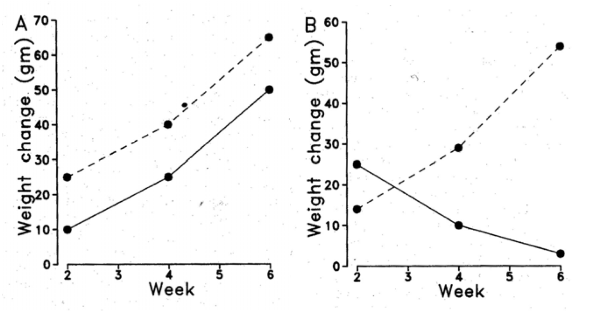

```{r setup, echo = FALSE, include=FALSE}
options(htmltools.dir.version = FALSE)
knitr::opts_chunk$set(echo = FALSE, fig.align = 'center', warning=FALSE, message=FALSE, 
                      fig.retina = 2, fig.width = 9, fig.height = 7)
source(here::here("R/zzz.R"))
library(emo)
library(kableExtra)
library(dplyr)
library(FANR6750)
# library(gganimate)
```

# outline 

<br/>

1) Motivation

<br/>

--

2) Split-plot with adjustments

<br/>

--

3) MANOVA


---
# motivation

<br/>

#### Suppose we want to test the eect of fertilizer on plant growth  

<br/>

--

#### We assign each of 10 plants to one of two treatments: low fertilizer and high fertilizer  

<br/>

--

#### How often should we measure each plant after the treatment?

---
# plant data

```{r}
data("plantData")

plantData_wide <- tidyr::pivot_wider(plantData, names_from = week,
                                     names_prefix = "Week", values_from = leaves)
plantData_wide <- dplyr::mutate(plantData_wide, 
                                fertilizer = dplyr::case_when(fertilizer == "L" ~ "Low",
                                                              fertilizer == "H" ~ "High"))
plantData_wide %>%
  kable(format = "html", col.names = c("Plant", "Fertilizer", "Week 1", "Week 2", "Week 3", "Week 4", "Week 5")) %>%
  add_header_above(c(" " = 1, " " = 1, "Leaves" = 5))
```

---
# plant data


```{r fig.height=6}
ggplot(plantData, aes(x = week, y = leaves, color = fertilizer, 
                      linetype = as.factor(plant))) +
  geom_path() +
  geom_point() +
  scale_x_continuous("Week") +
  scale_y_continuous("Leaves") +
  guides(linetype = "none")
```

--

#### What are the experimental units? How do we handle time?

---
# repeated measures designs

### General features  

- Whole units are called subjects  


--

- One or more treatments is applied to each subject  


--

- The response variable is measured multiple times on each subject  


--

- Time can be thought of as a treatment variable applied at the subunit level, but it *can't be randomly assigned*  


--

- We are often most interested in the interaction between treatment and time  


--

- In some cases, one of the treatment variables might be applied part way through the experiment. A BACI design is one example  


---
# examples of repeated measures designs

#### to investigate the effect of three drugs, each drug is administered to 8 people, and each person's heart rate is measured every 5 minutes for 4 time intervals  


#### The effects of predator exclosures are assessed by monitoring prey abundance over multiple years in exclosures and control sites  


#### The effect of dam removal is evaluated by measuring upstream fish abundance before and after dam removal at multiple rivers  

---
# options for analysis

#### At least three ways to analyze data from repeated measures designs  

1) Split-plot model with adjusted p-values  

2) Multivariate analysis of variance (MANOVA)  

3) (Linear) mixed-effects model (LMM) with serial correlation  

--

#### Methods (1) and (3) are often called "univariate" approaches, whereas (2) is considered to be multivariate  

--

#### I don't like these distinctions because (1) often uses multivariate techniques to make the adjustments and (3) can be multivariate as well  

---
class: inverse, middle, center

# split-plot with adjustments

---
# model

$$\Large y_{ijk} = \mu + \alpha_i + \beta_j + \alpha \beta_{ij} + \delta_{ik} + \epsilon_{ijk}$$

--

$$i = 1, ..., a \;(treatment \;levels)$$
$$j = 1, ..., b \;(time \; periods)$$
$$k = 1, ..., c \;(subjects \;per \;treatment \;level)$$
--

- $\mu =$ grand mean  

- $\alpha_i =$ effect of the $i$th treatment level  

- $\beta_{j} =$ effect of the $j$th level of time  

- $\alpha \beta_{ij} =$ interaction effect between treatment and time  

- $\delta_{ik} =$ subject effect  

- $\epsilon_{ijk} =$ residual, unexplained variation

---
# model

$$\Large y_{ijk} = \mu + \alpha_i + \beta_j + \alpha \beta_{ij} + \gamma_k + \delta_{ik} + \epsilon_{ijk}$$

<br/>

Because we want our inferences to apply to all subjects, $\delta_{ik}$ is random:  

$$\large \delta_{ik} \sim normal(0, \sigma^2_D)$$
--

If residuals are uncorrelated, we assume:

$$\large \epsilon_{ijk} \sim normal(0, \sigma^2)$$

<br/>

--

*p*-values based on this assumption will be wrong if the residuals are correlated  

--

**Note**: Hypothesis tests are analogous to those in the split-plot design  

---
# adjusting *p* -values

If we use a split-plot type of ANOVA, rather than a MANOVA or a mixed-effects model with serial correlation, we can deal with correlated residuals by adjusting the *p*-values  

--

The adjustments involve modifying the degrees-of-freedom of the *F* tests of the within-subjects factors (time and time-treatment interaction)  

--

Adjustments only make the *p*-values go up, so there is no need to bother with them if your tests aren't significant under the independence assumption  

--

The two common adjustment methods are called the **Greenhouse-Geisser** and the **Huynh-Feldt** methods. The latter is usually preferred because it is less biased and less conservative  

--

Both methods are only valid for approximately balanced designs when the condition of "*sphericity*" can be met (more on that later)  

---
# adjusted *p* -values

<br/>

```{r}
tab <- data.frame(col1 = c("Fertilizer", "Error (among-subjects", "Time", 
                           "Interaction", "Error (within-subjects)"),
                  df = c(1, 8, 4, 4, 32),
                  SS = c(16.8, 51.7, 267.4, 5.1, 13.5),
                  MS = c(16.8, 6.5, 66.8, 1.27, 0.42),
                  F = c(2.6, NA, 158.2, 3.0, NA),
                  p = c(0.145, NA, "<0.001", 3.0, NA),
                  p.adj = c(NA, NA, "<0.001", 0.042, NA))

options(knitr.kable.NA = " ")

tab %>%
  kable(format = "html", align = c("r", "c", "c", "c", "c", "c", "c"),
        col.names = c(" ", "df", "SS", "MS", "F", "p-value", "p-adj (H-F)"))
```

<br/>

--

#### Which is the only effect in the above table that is of interest?

---
class: inverse, middle, center

# manova

---
# manova

#### If the design is far from balanced, and the assumption of sphericity cannot be met, a multivariate analysis of variance (MANOVA) is preferred over the adjusted p-values approach

--

#### The two most common multivariate test statistics are:

- Wilks' lambda

- Pillai's trace

--

#### These tests are less powerful than those based on sphericity, but they have less restrictive assumptions  

---
# model

$$\LARGE y_{i} \sim MVN(\mu_i, \Sigma)$$

--

#### where

- $\large y_i$ is the multivariate response vector for subject *i*  

- $\large \mu_i$ is the vector of means for subject *i* (determined by the fixed effects and the subject-specific random effects)  

- $\large \Sigma$ is the variance-covariance matrix of the multivariate normal distribution. It has *T* rows and *T* columns, where *T* is the number of time periods  

--

#### Sphericity, in the context of repeated measures, is the condition in which the variance-covariance matrix has zeros on the off-diagonals. This can be tested using Mauchly's test  
--

#### Technical details with accompanying `R` code can be found in Dalgaard (2006), on eLC  

---
# profile analysis

#### MANOVA is typically used to test the effects of time or the time-treatment interaction. A common application is in growth studies  

--

#### We can think of several possible outcomes:

--

- If the interaction is significant, the growth curves will not be parallel  

--

- If the interaction is not significant, but the time effect is, then the curves will be parallel but not flat  

--

- If neither time nor the interaction is significant, the curves will be flat   

--

#### These possibilities can be explored using a profile analysis.

---
# profile analysis

```{r }

```


---
# profile analysis

#### Profile analysis can be performed by analyzing the differences in the response variable over consecutive time periods  

```{r}
plantData_wide %>%
  kable(format = "html", col.names = c("Plant", "Fertilizer", "Week 1", "Week 2", "Week 3", "Week 4", "Week 5")) %>%
  add_header_above(c(" " = 1, " " = 1, "Leaves" = 5)) %>%
  kable_styling(bootstrap_options = c("responsive", "condensed", "hover"), font_size = 12, full_width = TRUE) %>%
  scroll_box(width = "100%", height = "67%")
```


---
# profile analysis

#### Profile analysis can be performed by analyzing the differences in the response variable over consecutive time periods  

```{r}
plantData_wide2 <- dplyr::mutate(plantData_wide, int1 = Week2 - Week1,
                                 int2 = Week3 - Week2,
                                 int3 = Week4 - Week3,
                                 int4 = Week5 - Week4)
plantData_wide2 %>% 
  dplyr::select(plant, fertilizer, int1, int2, int3, int4) %>%
  kable(format = "html", col.names = c("Plant", "Fertilizer", "Interval 1", "Interval 2", "Interval 3", "Interval 4")) %>%
  add_header_above(c(" " = 1, " " = 1, "New Leaves" = 4)) %>%
  kable_styling(bootstrap_options = c("responsive", "condensed", "hover"), font_size = 12, full_width = TRUE) %>%
  scroll_box(width = "100%", height = "67%")
```

---
# profile analysis

<br/>

#### The effect of treatment on growth rate can be tested using a MANOVA on the differences  

<br/>

--

#### If the multivariate test is significant, univariate ANOVAs $-$ one for each time period $-$ can be used to determine when the treatment had significant effects  

<br/>

--

#### We will cover this in lab  

 

---
# summary

<br/>

#### Which of the three methods should I use?  

--

- It's up to you!  

--

- The simplest approach might be the split-plot option with adjusted p-values  

--

- The most robust approach might be the MANOVA  

--

- Another alternative approach, linear mixed models with serial correlation, is 
flexible enough to handle many different designs and data characteristics preference  


