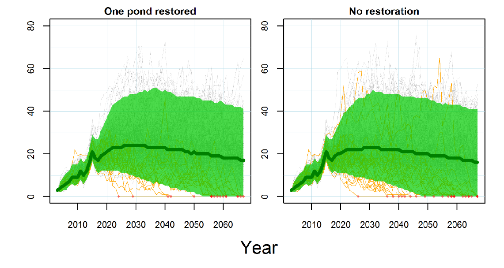

```{r setup, echo = FALSE, include=FALSE}
options(htmltools.dir.version = FALSE)
knitr::opts_chunk$set(echo = FALSE, fig.align = 'center', warning=FALSE, message=FALSE, 
                      fig.retina = 2, fig.width = 9, fig.height = 6)
source(here::here("R/zzz.R"))
library(emo)
library(kableExtra)
library(dplyr)
library(FANR6750)
# library(gganimate)
```

# outline 

<br/>

1) Motivation

<br/>

--

2) Linear models

<br/>

--

3) Example

<br/>

--

4) Matrix notation


---
# motivation

#### Why do we need this part of the course?

--

- We have been modeling all along  

--

- Good experimental design + ANOVA is often the most direct route to causal inference  

--

- However, it isn’t always possible (or even desirable) to control some aspects of the system being
investigated  

--

- When manipulative experiments aren’t possible, observational studies and predictive models can be
the next best option


---
# what is a model?

#### Definition

> A model is an abstraction of reality used to describe the relationship between two or more variables

--

#### Types of models

- Conceptual  

- Mathematical  

- Statistical  

--

#### Cautionary note

> All models are wrong but some are useful (George Box, 1976)

---
# statistical models

<br/>

#### What are they useful for?

--
- Formalizing hypotheses using math and probability  

--

- Evaulating hypotheses by confronting models with data  

--

- Predicting unobserved (including future) outcomes

```{r out.width="60%", out.height="60%"}

```

---
# statistical models


#### Unlike many other types of models, statistical models are fitted to data

--

#### Two important components:

1) Deterministic component

- Equation for the expected value of the response variable  

--

2) Stochastic component

- Probability distribution describing the differences between the expected values and the observed values

- In parametric statistics, we assume we know the distribution, but not the parameters of the distribution

---
class: inverse, center, middle

# linear models

---
# is this a linear model?

$$\Large y = 20 + 0.5x$$

```{r}
x <- seq(from = 0, to = 10, 0.1)
lm <- data.frame(x = x,
                 y = 20 + 0.5 * x)

ggplot(lm, aes(x = x, y = y)) +
  geom_line() 
```

---
# is this a linear model?

$$\Large y = 20 + 0.5x - 0.3x^2$$

```{r}
x <- seq(from = 0, to = 10, 0.1)
lm2 <- data.frame(x = x,
                 y = 20 + 0.5 * x - 0.3 * x^2)

ggplot(lm2, aes(x = x, y = y)) +
  geom_line() 
```

---
# linear models

### All of the models we've covered this semester, including fixed-effects regression and ANOVA, are linear models  

--

#### You must understand linear models before you can apply more advanced models such as GLMs, GAMS, GLMMs, etc. . .

---
# linear models

#### A linear model is an equation of the form:

$$\large y_i = \beta_0 + \beta_1x_{i1} + \beta_2x_{i2} + ... + \beta_px_{ip} + \epsilon_i$$

where the $\beta$’s are coefficients, and the $x$ values are predictor variables (or dummy variables for categorical predictors)  

--

#### This equation is often expressed in matrix notation as:

$$\Large y = \mathbf{X \beta} + \epsilon$$
where $\mathbf{X}$ is a **design matrix** and $\mathbf{\beta}$ is a vector of coefficients  

--

More on matrix notation later...

---
## INTERPRETING THE $\beta$'s

<br/>

#### You must be able to interpret the $\large \beta$ coefficients for any model that you fit to your data

<br/>

--

#### A linear model might have dozens of continuous and categorical predictors variables, with dozens of associated $\large \beta$ coefficients  

<br/>

--

#### Linear models can also include polynomial terms and interactions

---
## INTERPRETING THE $\beta$'s

#### The intercept $\large \beta_0$ is the expected value of $\large y$, when all $\large x$’s are 0

--

#### If $\large x$ is a continuous explanatory variable:

- $\large \beta$ can usually be interpreted as a slope parameter  

- In this case, $\large \beta$ is the change in $\large y$ resulting from a 1 unit change in $\large x$ (while holding the other predictors constant)  

```{r}
set.seed(13455)
beta0 <- 10
beta1 <- 1
x <- runif(100, 0, 50)
df <- data.frame(x = x, 
                 Ey = beta0 + beta1 * x,
                 y = rnorm(100, beta0 + beta1 * x, 5))
```

.pull-left[

```{r echo = TRUE}
lm(y ~ x, data = df)
```

]

.pull-right[

```{r}
ggplot(df, aes(x = x, y = y)) +
  geom_point() +
  stat_smooth(method = "lm", se = FALSE)
```
]


---
### INTERPRETING THE $\large \beta$'s FOR CATEGORICAL PREDICTORS

#### Things are more complicated for categorical explantory variables (i.e., factors) because they must be converted to dummy variables  

--

#### There are many ways of creating dummy variables  

In `R`, the default method for creating dummy variables from unordered factors works like this:

- One level of the factor is treated as a reference level  

- The reference level is associated with the intercept  

- The $\beta$ coefficients for the other levels of the factor are differences from the reference level  

--

#### The default method corresponds to:

```
options(contrasts=c("contr.treatment","contr.poly"))
```

---
### INTERPRETING THE $\large \beta$'s FOR CATEGORICAL PREDICTORS

#### Another common method for creating dummy variables results in $\large \beta$’s that can be interpretted as the $\large \alpha$’s from the additive models that we saw earlier in the class  

--

#### With this method:

- The $\beta$ associated with each level of the factor is the difference from the intercept

- The intercept can be interpetted as the grand mean if the continuous variables have been centered

- One of the levels of the factor will not be displayed because it is redundant when the intercept is estimated

--

#### This method corresponds to:

```
options(contrasts=c("contr.sum","contr.poly"))
```

---
class: inverse, middle, center

# example

---
# example

### The Island Scrub Jay (*Aphelocoma insularis*)


```{r out.height="70%", out.width="70%"}
knitr::include_graphics("https://upload.wikimedia.org/wikipedia/commons/5/55/Aphelocoma_insularis_Bouton_2.jpg")
```

---
# example

```{r out.height="100%", out.width="100%"}
knitr::include_graphics("figs/santa_cruz.png")
```

---
# santa cruz data

#### Habitat data for all 2787 grid cells covering the island

```{r echo = TRUE}
data("cruzData")
head(cruzData)
```

---
# maps of predictor variables

### Elevation

```{r}
projcrs <- "+proj=longlat +datum=WGS84 +no_defs +ellps=WGS84 +towgs84=0,0,0"

cruz_sf <- sf::st_as_sf(x = cruzData, coords = c("x", "y"), crs = projcrs)

ggplot(cruz_sf) +
  geom_sf(aes(color = elevation), shape = 15, size = 2)
```

---
# maps of predictor variables

### Forest cover

```{r}
ggplot(cruz_sf) +
  geom_sf(aes(color = forest), shape = 15, size = 2)
```

---
# questions

<br/>

--
1) How many jays are on the island?  

<br/>

--

2) What environmental variables influence abundance?  

<br/>

--

3) Can we predict consequences of environmental change?  


---
# maps of predictor variables

### Chaparral and survey locations

```{r}
data("jayData")
jay_sf <- sf::st_as_sf(x = jayData, coords = c("x", "y"), crs = projcrs)
ggplot() +
  geom_sf(data = cruz_sf, aes(color = chaparral), shape = 15, size = 2) +
  geom_sf(data = jay_sf, color = "red")
```

---
# the (fake) jay data

```{r echo = TRUE}
data("jayData")
head(jayData)
```

---
# simple linear regression

```{r echo = TRUE, eval = FALSE}
fm1 <- lm(jays ~ elevation, data = jayData)
broom::tidy(fm1)
```

```{r echo = FALSE}
fm1 <- lm(jays ~ elevation, data=jayData)
kable(broom::tidy(fm1))
```

???

Don't forget that you can also use `broom::glance()` to get other output in data.frame format

---
# simple linear regression

```{r}
ggplot(jayData, aes(x = elevation, y = jays)) +
  geom_point() +
  scale_x_continuous("Elevation") +
  scale_y_continuous("Jays") +
  stat_smooth(method = "lm")
```

---
# multiple linear regression

```{r echo = TRUE, eval = FALSE}
fm2 <- lm(jays ~ elevation + forest, data = jayData)
broom::tidy(fm2)
```

```{r echo = FALSE}
fm2 <- lm(jays ~ elevation + forest, data=jayData)
kable(broom::tidy(fm2))
```


---
# multiple linear regression

```{r}
ggplot(jayData, aes(x = forest, y = elevation, size = jays)) +
  geom_point() +
  scale_x_continuous("Forest") +
  scale_y_continuous("Elevation")
```

---
# one-way anova


```{r echo = TRUE, eval = FALSE}
fm3 <- lm(jays ~ habitat, data = jayData)
broom::tidy(fm3)
```

```{r echo = FALSE}
fm3 <- lm(jays ~ habitat, data=jayData)
kable(broom::tidy(fm3))
```


---
# one-way anova

```{r}
ggplot(jayData, aes(x = habitat, y = jays)) +
  geom_boxplot() +
  scale_x_discrete("Habitat") +
  scale_y_continuous("Jays")
```

---
# ancova

```{r echo = TRUE, eval = FALSE}
fm4 <- lm(jays ~ habitat + elevation, data = jayData)
broom::tidy(fm4)
```

```{r echo = FALSE}
fm4 <- lm(jays ~ habitat + elevation, data=jayData)
kable(broom::tidy(fm4))
```


---
# ancova

```{r}
fm4 <- lm(jays ~ habitat + elevation- 1, data = jayData)

anc <- data.frame(habitat = c("Bare", "Oak", "Pine"),
                  intercept = coef(fm4)[1:3],
                  slope = coef(fm4)[4])

ggplot(jayData, aes(x = elevation, y = jays, color = habitat)) +
  geom_point() +
  scale_x_continuous("Elevation") +
  scale_y_continuous("Jays") +
  geom_abline(data = anc, aes(intercept = intercept, slope = slope, color = habitat))
```

---
# continuous-categorical interaction

```{r echo = TRUE, eval = FALSE}
fm5 <- lm(jays ~ habitat * elevation, data = jayData)
broom::tidy(fm5)
```

```{r echo = FALSE}
fm5 <- lm(jays ~ habitat * elevation, data=jayData)
kable(broom::tidy(fm5))
```


---
# continuous-categorical interaction

```{r}
fm5 <- lm(jays ~ habitat * elevation- 1, data = jayData)

anc <- data.frame(habitat = c("Bare", "Oak", "Pine"),
                  intercept = coef(fm5)[1:3],
                  slope = c(coef(fm5)[4], 
                            coef(fm5)[4] + coef(fm5)[5], 
                            coef(fm5)[4] + coef(fm5)[6]))

ggplot(jayData, aes(x = elevation, y = jays, color = habitat)) +
  geom_point() +
  scale_x_continuous("Elevation") +
  scale_y_continuous("Jays") +
  geom_abline(data = anc, aes(intercept = intercept, slope = slope, color = habitat))
```

---
# quadratic effect of elevation

```{r echo = TRUE, eval = FALSE}
fm6 <- lm(jays ~ elevation + I(elevation^2), data = jayData)
broom::tidy(fm6)
```

```{r echo = FALSE}
fm6 <- lm(jays ~ elevation + I(elevation^2), data = jayData)
kable(broom::tidy(fm6))
```


---
# quadratic effect of elevation

```{r}
ggplot(jayData, aes(x = elevation, y = jays)) +
  geom_point() +
  scale_x_continuous("Elevation") +
  scale_y_continuous("Jays") +
  stat_smooth(method = "lm", formula = y ~ x + I(x^2), size = 1)
```

---
# interaction and quadratic effects


```{r echo = TRUE, eval = FALSE}
fm7 <- lm(jays ~ habitat * forest + elevation + I(elevation^2), data = jayData)
broom::tidy(fm7)
```

```{r echo = FALSE}
fm7 <- lm(jays ~ habitat * forest + elevation + I(elevation^2), data = jayData)
kable(broom::tidy(fm7))
```


---
# Predict jay abundance at each grid cell

```{r echo = TRUE}
E5 <- predict(fm5, type="response", newdata=cruzData, interval="confidence")
```

```{r echo = TRUE}
E5 <- cbind(cruzData[,c("x","y")], E5)
head(E5)
```

---
# map the predictions


```{r}
E5_sf <- sf::st_as_sf(x = E5, coords = c("x", "y"), crs = projcrs)

ggplot(E5_sf) +
  geom_sf(aes(color = fit), shape = 15, size = 2) +
  scale_color_viridis_c(limits = c(30, 55)) +
  labs(title = "Expected number of Jays")
```

---
# map the predictions


```{r}
ggplot(E5_sf) +
  geom_sf(aes(color = lwr), shape = 15, size = 2) +
  scale_color_viridis_c(limits = c(30, 55)) +
  labs(title = "Lower CI")
```

---
# map the predictions

```{r}
ggplot(E5_sf) +
  geom_sf(aes(color = upr), shape = 15, size = 2) +
  scale_color_viridis_c(limits = c(30, 55)) +
  labs(title = "Upper CI")
```

---
# future scenarios

#### What if pine and oak disappear?


```{r}
ggplot(E5_sf) +
  geom_sf(aes(color = fit), shape = 15, size = 2) +
  scale_color_viridis_c(limits = c(30, 55)) +
  labs(title = "Expected number of Jays (current habitat)")
```

---
# future scenarios

#### What if pine and oak disappear?


```{r}
cruzData2 <- cruzData
cruzData2$habitat <- "Bare"
E5.2 <- predict(fm5, type="response", newdata=cruzData2, interval="confidence")

E5.2 <- cbind(cruzData[,c("x","y")], E5.2)

E5.2_sf <- sf::st_as_sf(x = E5.2, coords = c("x", "y"), crs = projcrs)

ggplot(E5.2_sf) +
  geom_sf(aes(color = fit), shape = 15, size = 2) +
  scale_color_viridis_c(limits = c(30, 55)) +
  labs(title = "Expected number of Jays (no pine/oak)")
```

---
class: center, middle, inverse

# matrix notation

---
# matrix notation

<br/>

#### Linear models are often expressed in matrix notation

<br/>

#### There are two reasons for this:

- It is more compact and therefore easier to write  

- Matrix multiplication is fast on a computer  

---
# linear model

#### All of the fixed effects models that we have covered can be expressed this way:

$$\Large y = \mathbf{X \beta} + \epsilon$$

where

$$\large \epsilon \sim normal(0, \sigma^2)$$
--

#### Examples include

- Completely randomized ANOVA  

- Randomized complete block designs with fixed block effects  

- Factorial designs  

- ANCOVA  

---
# then how do they differ?

<br/>

--

- The design matrices are different  

--

- And so are the number of parameters (coefficients) to be estimated  

--

- Important to understand how to construct design matrix that includes categorical variables  

---
# design matrix

<br/>

- A design matrix has $N$ rows and $K$ columns, where $N$ is the total sample size and $K$ is the number of coefficients (parameters) to be estimated  

--

- The first column contains just 1’s. This column corresponds to the intercept ($\beta_0$)  

--

- Continuous predictor variables appear unchanged in the design matrix  

--

- Categorical predictor variables appear as dummy variables  

--

- In `R`, the design matrix is created internally based on the formula that you provide  

--

- The design matrix can be viewed using the `model.matrix()` function

---
# design matrix

#### Model

```{r echo = TRUE}
fm1 <- lm(jays ~ elevation, data = jayData)
```

--

#### Design matrix

```{r echo = TRUE}
X1 <- model.matrix(fm1)
head(X1, n = 4) # First 4 rows of design matrix
```

--

#### Estimated $\large \beta$ coefficients  

```{r echo = TRUE}
(beta.hat1 <- coef(fm1)) # Estimates of beta0 and beta1
```

---
# matrix multiplication

<br/>

$$\Large E(y) = \mathbf{X \beta}$$

<br/>

--

$$\large \begin{bmatrix}
    a\times x + b\times y + c\times z\\
    d\times x + e\times y + f\times z\\
    g\times x + h\times y + i\times z
\end{bmatrix} = \begin{bmatrix}
    a & b & c \\
    d & e & f \\
    g & h & i 
\end{bmatrix}\;\;
\mathbf \times \begin{bmatrix}
    x \\
    y \\
    z
\end{bmatrix}$$

<br/>

--

where:  

- The first matrix corresponds to the expected values of $y$  

- The second matrix corresponds to the design matrix $\mathbf{X}$  

- The third matrix corresponds to $\mathbf{\beta}$

---
# matrix multiplication

<br/>

$$\Large E(y) = \mathbf{X \beta}$$ or $$\Large E(y_i) = \beta_0 + \beta_1ELEV_i$$

<br/>

```{r echo = TRUE}
Ey1 <- X1 %*% beta.hat1 # Expected number of jays at each site
head(Ey1, 5)
```

---
# design matrix for ancova

#### Model

```{r echo = TRUE}
fm4 <- lm(jays ~ elevation + habitat, data = jayData)
```

--

#### Design matrix

```{r echo = TRUE}
X4 <- model.matrix(fm4)
head(X4, n = 4) # First 4 rows of design matrix
```

--

#### Estimated $\large \beta$ coefficients

```{r echo = TRUE}
(beta.hat4 <- coef(fm4)) # Estimates of beta0 and beta1
```

--

How do we multiply the design matrix ($\mathbf{X}$) by the vector of regression coefficients ( $\beta$)?

---
# matrix multiplication

$$\Large E(y) = \mathbf{X \beta}$$ or 
$$\large E(y_i) = \beta_0 + \beta_1ELEV_i + \beta_2OAK_i + \beta_3PINE_i$$
<br/>

```{r echo = TRUE}
Ey4 <- X4 %*% beta.hat4 # Expected number of jays at each site
head(Ey4, 5)
```

---
# summary

<br/>

--

- Linear models are the foundation of modern statistical modeling techniques  

<br/>

--

- They can be used to model a wide array of biological processes, and they can be easily extended when their assumptions do not hold  

<br/>

--

- One of the most important extensions is to cases where the residuals are not normally distributed. Generalized linear models address this issue  


