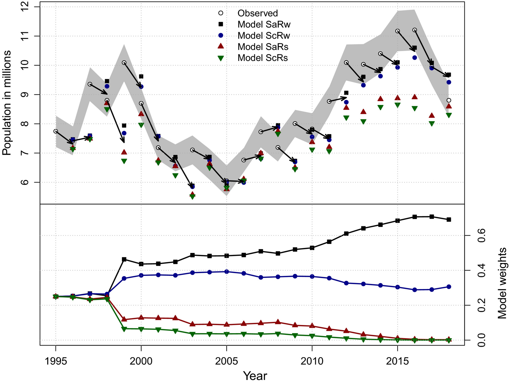

```{r setup, echo = FALSE, include=FALSE}
options(htmltools.dir.version = FALSE)
knitr::opts_chunk$set(echo = FALSE, fig.align = 'center', warning=FALSE, message=FALSE, 
                      fig.retina = 2, fig.width = 9, fig.height = 6)
# library(WILD3810)
#library(emo)
library(kableExtra)
library(dplyr)
library(ggplot2)
library(FANR6750)
# library(gganimate)
```

# outline 

<br/>

1) Motivation

<br/>

--

2) Approaches to model selection

<br/>

--

3) AIC


---
# motivation

#### As scientists, we usually have more than one hypothesis (or none at all!)  

<br/>

--

#### Consequently, we usually want to evaluate more than one model  

<br/>

--

#### **Model selection** is the process of choosing which model is most supported by our data

<br/>

--

#### Model selection is one of the most highly debated (and confusing) topics we will cover this semester

---
# model selection approaches

**Comparison of 2 (nested) models**  
- Likelihood-ratio test  


**Stepwise procedures**  
- Forward/backward/stepwise selection  


**Information-theortic approaches**  
- Akaike’s Information Criterion (AIC)  


**Cross-validation**  
- Leave-one-out  
- K-fold  


**Out-of-sample validation**  
- Compare predictions to new data

---
# questions

<br/>

#### How do we know which model is best?  

<br/>

--

#### Are any of them any good?  

<br/>


--

#### What is a good model?

<br/>

--

### The answers to these questions usually depend on *what* we want our models to do

---
# goals of modeling

### Exploration

- Identify potential relationships between variables

- *Generate* hypotheses

--

### Inference

- *Test* a priori hypotheses

--

### Prediction

- Predict response variable outside of observed data (usually to unobserved locations or future times)


--

#### The same data **cannot** be used for both exploration and inference 

---
# approaches to model selection

#### The most appropriate approach to model selection depends on what you want the model to do

--

#### The first step in any analysis is to determine what your goal is (exploration, inference, or prediction)

- Confusion about model selection often comes from not defining a clear goal

- Sometimes the goal will not be obvious 

--

#### Excellent paper:

> Tredennick, A. T., Hooker, G., Ellner, S. P., & Adler, P. B. (2021). A practical guide to selecting models for exploration, inference, and prediction in ecology. [Ecology, 102(6), e03336.](https://esajournals.onlinelibrary.wiley.com/doi/pdfdirect/10.1002/ecy.3336?casa_token=lJ3FPGPERrEAAAAA:0iXyzHKOWSJCr7lnwryWsJuXNTCITGhZa6bsRL5rSR8deXYWDmw99yhUPHomkVmf3iso_lZsahbXYEc)

---
class: middle, center, inverse

# inference

---
# inference

#### Inference is a central objective of science

- Using data to evaluate support for a hypothesis

--
</br>

$$\Large E(y_i) = \beta_0 + \beta_1  x^1_i + \beta_2  x^2_i$$

</br>

--

- Are coefficients ( $\beta_0$, $\beta_1$, $\beta_2$ ) non-zero?

--

- Are coefficients positive or negative?

--

- Which covariate ( $x^1$ or $x^2$ ) has a larger effect on $y$?

--

#### The concepts we've learned this semester regarding null hypothesis testing and effect sizes are used for inference


---
# inference


#### For a well-designed study focused on inference, null hypothesis testing from a single model may be sufficient 

--

#### The main risk when conducting inference is Type I error

- For any single study/data set, significant results may be to due to sampling error

--

#### As a field, inference is strengthed by replication and validation

--

#### For a single study, risk of spurious results can be reduced by formulating strong hypotheses

- Covariates should be selected based on strong *a priori* reason to believe they influence response variable

- Where do *a priori* hypotheses come from? Theory (ideally) or...

---
class: middle, center, inverse

# exploration

---
# exploration

**Exploratory studies are a key part of the scientific process**

- Help identify *potential* relationships between variables

- Particularly common in observational studies with lots of covariates

- e.g., which weather covariates influence abundance of wildlife species?

--

**The main risk for exploratory analyses is detecting spurious relationships**

- Often desirable to "cast a wide net" for potential predictors (don't want to miss something important), but including more predictors increases risk of Type I error 

--

**Part of the [replication crisis](https://www.ncbi.nlm.nih.gov/pmc/articles/PMC1182327/) stems from treating exploratory analyses as if they are testing hypotheses**

- Evidence of a relationship should be a treated as a proposed hypothesis, which requires testing via **new** data sets (and ideally manipulative experiments)

---
class: middle, center, inverse

# prediction

---
# prediction

#### Historically, exploration and inference have been the primary focus in ecological research

- Out-sized emphasis on null hypothesis testing + very complex systems

- More prominent in other fields (meteorology, economics, political science)

--

#### Prediction is increasingly used to:

- Forecast ecological systems (e.g., population viability analysis)

- Test theory 

- Aid decision making (e.g., adaptive management)

---
# prediction

</br>

$$\Large E(y_i) = \beta_0 + \beta_1  x^1_i + \beta_2  x^2_i$$

--

- *Inference* focuses on $\beta_0$, $\beta_1$, and $\beta_2$

--

- *Prediction* focuses on $E(y_i)$

</br>
--

**Question**: Does a model that provides the best predictions also provide the best inference?

--

**Answer**: No! Because:

- Models that predict well might include many correlated but unimportant covariates

- Models that provide reliable inference may not include covariates relevant to prediction

---
# prediction

</br>

### In general, we seek models that are as simple as possible (but not more so)

</br>

--

### Why do we want simplicity?

---
# fit and over-fit

#### $\large R^2$ is a measure of model fit  

--

#### Questions

- Does the addition of a new predictor variable always increase $R^2$?  

--

- Do we want the model with the highest $R^2$?  

--

- What is the harm in adding "extra" predictor variables?

<br/>

--

#### Overly-complicated models don’t predict well. They are too specific to a particular dataset.

---
# fit and over-fit

<br/>

```{r fig.height=5}
set.seed(123456)
x <- runif(10, 0, 10)

e.y <- 3.2 + 3 * x

y <- rnorm(10, e.y, 3)

df <- data.frame(x = x, y = y)

ggplot(df, aes(x = x, y = y)) +
  geom_point() +
  stat_smooth(method = "loess", se = FALSE) +
  geom_abline(intercept = 3.2, slope = 3, color = "black")
```

---
# prediction


#### Predictive ability is assessed by comparing *predicted* values to *observed* values

- But we can't use the same values for both prediction and validation

--

#### Ideally, we compare predictions to *out of sample* values

- Predict future values, gather data, compare values (e.g., [waterfowl management](https://onlinelibrary.wiley.com/doi/full/10.1002/ece3.5836))

```{r out.height="225px", out.width="280px"}

```


---
# prediction


#### Predictive ability is assessed by comparing *predicted* values to *observed* values

- But we can't use the same values for both prediction and validation


#### Ideally, we compare predictions to *out of sample* values

- Predict future values, gather data, compare values (e.g., [waterfowl management](https://onlinelibrary.wiley.com/doi/full/10.1002/ece3.5836))

- Divide data into "training" and "testing" (possibly repeated multiple times, i.e. *cross validation)

--

#### Predictive accuracy can also be approximated using *Information-theoretic* approaches


---
class: middle, inverse, center

# aic

---
# aic

#### Minus twice the (maximized) log-likelihood plus two times the number of parameters

$$\Large AIC = -2L(\hat{\theta}, y) + 2K$$

--

#### Or, when ordinary least squares (OLS) is used for estimation, AIC is based on the residual sums-of-squares (RSS):

$$\Large AIC = n \log(RSS/n) + 2K$$
--

#### The key is to recognize that

> AIC = measure of fit + complexity penalty

<br/>

--

AIC is asymtotically equivalent to leave-one-out cross-validation

---
# aic in practice

1) Select a set of candidate models

--

2) Fit the models to the data (maximize the likelihood or minimize the RSS)  

--

3) Compute the AIC of each model  

--

4) Rank the models by AIC (lower AIC is better)  

--

5) Compute the difference in AIC scores between the best model, and every other model  

$$\large \Delta_i = AIC_i - AIC_{min}$$
--

6) Compute the Akaike weight of each model:

$$\large w_i = \frac{e^{-0.5\Delta_i}}{\sum_i e^{-0.5 \Delta_i}}$$

--

7) A model with $w = 0.6$ is twice as likely to be the best model in the set as a model with $w = 0.3$

---
# presentation of results

<br/>

```{r}
aic.tab <- data.frame(Model = 1:4,
                      RSS = c(300, 320, 330, 330),
                      K = c(2, 3, 3, 5),
                      AIC = c(113.8, 122.3, 125.4, 129.4),
                      dAIC = c(0, 8.4, 11.5, 15.5),
                      w = c(0.98, 0.02, 0.0, 0.0))

aic.tab %>%
  kable(format = "html", booktab = TRUE, col.names = c("Model", "RSS", "K", "AIC", "\\(\\Delta_{AIC}\\)", "w"), escape = FALSE, align = "c")
```

???

Residual sum of squares (RSS) replaced by log likelihood if using maximum likelihood estimation

---
# small sample size adjustment

<br/>
<br/>

#### The last term is the “bias adjustment term”

$$\Large AIC_c = n \log(RSS/n) + 2K + \frac{2K(K + 1)}{n - K - 1}$$

---
# notes about aic


#### AIC is not a test  

--

#### AIC is a relative measure. You can’t compare the AICs of models fit to different datasets  

--

#### AIC tells you about the *relative* predictive ability of the model set, not the *absolute* predictive ability  

- There will always be a model with the lowest AIC. But all of the models in the set could be terrible  

--

#### Because AIC is based on predictive ability, it will be more likely to select unimportant/spurious covariates than NHST

--

#### AIC is best suited for *exploratory* analyses (lot's of potential covariates w/o *a priori* hypotheses). If goal is inference, use NHST. If goal is prediction, use validation 


